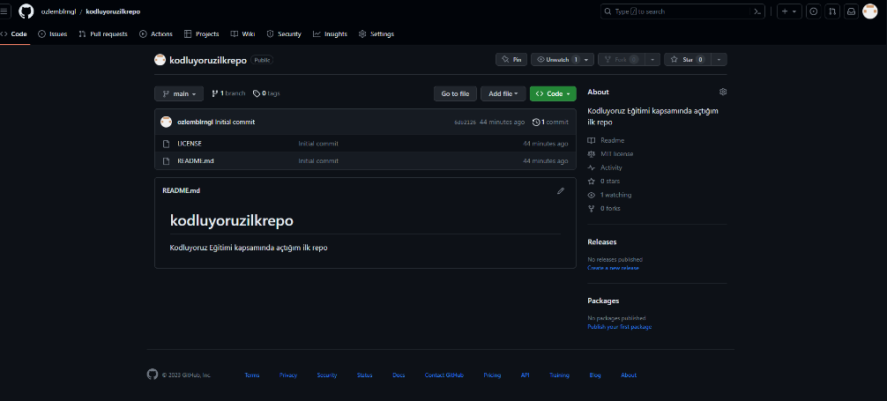

# kodluyoruzilkrepo



**Bu repo [kodluyoruz][df1] Front-End Eğitiminde oluşturduğumuz ilk repo. İçerisinde bir adet README dosyası, bir adet de index.html barındırıyor.**

## Installation

**Öncelikle projeyi klonlayın.**

`https://github.com/ozlemblrngl/kodluyoruzilkrepo.git`

## Usage

**Projeyi cloneladıktan sonra Visual Studio Code programında açınız.**

Linux için:

```
cd kodluyoruzilkrepo
code .
```

## Contributing

**Pull requestler kabul edilir. Büyük değişiklikler için, lütfen önce neyi değiştirmek istediğinizi tartışmak için bir konu açınız.**

## Licence

[ MIT][df2]

[df1]: <https://kodluyoruz.org/>
[df2]: <https://choosealicense.com/licenses/mit/>


